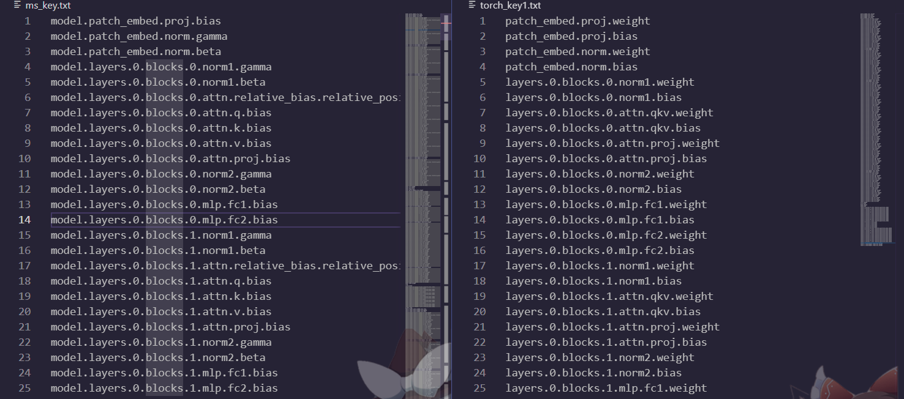

# torch2mindspore
Some scripts or steps to convert a .pth file(torch-like) into  .ckpt file(mindspore-like)

## Environments
+ pytorch
+ mindspore


## Explanation
I cound not find a simple way to transfrom weights between pytorch and minspore. So there is only this troublesome method.The model weights file of deep learning is actually a dictionary in python. It contains the key pair formed by the weight name and the weight value.What you have to do is comparing the keys between two file(mindspore weights and torch weights), and try to form a new directory with the key order of mindspore weights file and  correspond with right value of pytorch weights file.

## Steps

### 1. Get Weights File

You need to get both pytorch weights file(.pth) and mindspore weights file(.ckpt). 

### 2. Find Keys and Values
Use [load_model.py](load_model.py) to print keys(weights name) in .pth and .ckpt into .txt . The format of directory may be different so sometimes you need change the scripts.

```python
python load_model.py
```


### 3. Compare keys  
The goal is to get a keys list of torch model in mindspore order

### 4. Convert
Write the scripts you need as you have find the regularity between two model weights file.Then
```python
python convert.py
```